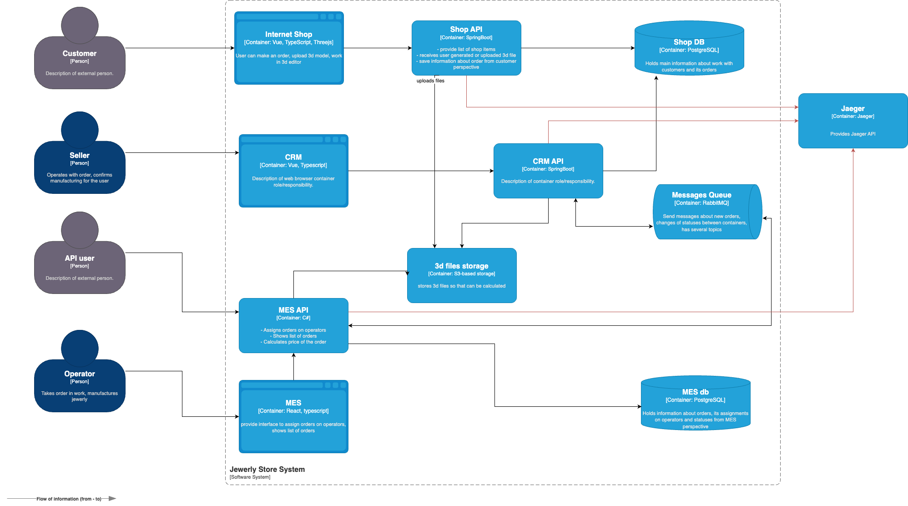

# Архитектурное решение по трейсингу 

## Анализ системы и проблем

### Потенциальные места проблем:
1. **Shop API**:
    - Проблемы при загрузке 3D-модели.
    - Задержки при переходе заказа в статус `SUBMITTED`.

2. **CRM API**:
    - Потеря статуса при переводе заказа в `MANUFACTURING_APPROVED`.
    - Ошибки в передаче данных от MES.

3. **MES API**:
    - Задержки при переводе заказа в статусы производства (`MANUFACTURING_STARTED`, `MANUFACTURING_COMPLETED`).
    - Проблемы с финальными статусами (`PACKAGING`, `SHIPPED`).

### Требуемые данные для трейсинга:
- Идентификатор заказа.
- Текущий статус заказа.
- Время обработки на каждом этапе.
- Данные о системе, обрабатывающей запрос.
- Метаданные загруженной 3D-модели.

---

## Мотивация

Трейсинг позволит:
1. Уменьшить время на диагностику проблем.
2. Предотвратить потерю заказов.
3. Повысить производительность за счёт своевременного выявления узких мест.
4. Снизить количество жалоб клиентов, благодаря оперативному реагированию.

---

## Предлагаемое решение

1. **Используемый инструмент**: Jaeger (для визуализации трейсинга).
2. **Внедрение OpenTelemetry**:
    - Интеграция с API (Shop, CRM, MES).
    - Настройка передачи данных в Jaeger.

3. **Сбор и хранение данных**:
    - Использовать ClickHouse как хранилище трейсингов.
    - Настроить уровни детализации.

4. **Безопасность**:
    - Доступ только для DevOps, разработчиков и сотрудников поддержки.
    - Шифрование данных в процессе передачи.

---

## Компромиссы

1. **Проприетарные системы**: возможны сложности в интеграции.
2. **Редкость межсервисного взаимодействия**: в таких случаях трейсинг может оказаться избыточным.

---

## Диаграмма C4 с трейсингом

