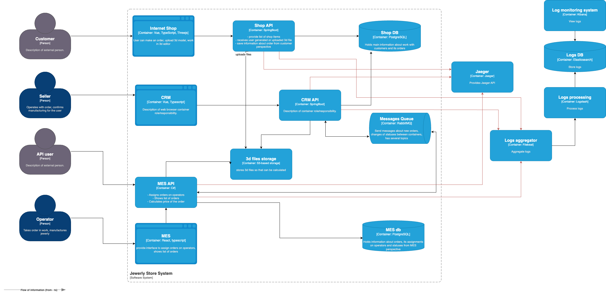

# Архитектурное решение по логированию

## Анализ системы и C4-диаграммы в контексте планирования логирования

Система нуждается в логировании для:
1. Отслеживания ошибок и исключений.
2. Анализа производительности и задержек.
3. Детализации действий пользователей и интеграционных сервисов.

### Описание собираемых логов

#### Уровень INFO
1. **API запросы и ответы:**
    - Записываемые параметры: время запроса, endpoint, статус ответа, идентификатор сессии.
2. **Создание заказа:**
    - Параметры: время создания, идентификатор пользователя, идентификатор заказа.
3. **Изменение статуса заказа:**
    - Параметры: время изменения, идентификатор заказа, старый статус, новый статус.
4. **Сообщения в очередь:**
    - Входящие: время поступления, очередь, идентификатор сообщения.
    - Исходящие: время обработки, очередь, идентификатор сообщения.

#### Уровень ERROR
1. **Недоступность внешней системы (БД, MQ и др.):**
    - Время обращения, информация о внешней системе.
2. **Ошибки обработки запроса:**
    - Время ошибки, описание ошибки.

#### Уровень DEBUG (Dev/Release окружения)
- Логирование входных/выходных параметров методов.
- Логирование условий выполнения.

---

## Мотивация

1. Повышение качества обслуживания клиентов.
2. Снижение времени на диагностику проблем.
3. Обеспечение анализа эффективности и стабильности системы.

---

## Предлагаемое решение

### Технологии:
1. **Сбор логов:**
   - **Filebeat**: сбор логов с хостов и контейнеров.
   - **Logstash**: обработка и маршрутизация логов.
2. **Обработка и хранение:**
   - **Elasticsearch**: централизованное хранилище логов.
3. **Визуализация:**
   - **Kibana**: для анализа и мониторинга логов.
4. **Логгеры приложений:**
   - Java: Logback.
   - C#: Serilog.

---

### Роль Filebeat:
1. Сбор логов с файлов (например, ротация логов приложений) и системных журналов.
2. Легковесный агент, устанавливаемый на всех серверах (Shop, CRM, MES).
3. Отправляет логи в Logstash для дальнейшей обработки.

### Архитектура с Filebeat:
1. Приложения (Shop API, CRM API, MES API) пишут логи в файлы или консоль.
2. **Filebeat** собирает эти логи.
3. **Logstash** обрабатывает логи (добавляет теги, преобразует формат).
4. **Elasticsearch** хранит обработанные данные.
5. **Kibana** визуализирует данные.

---

### Политика безопасности:
1. Исключение из логов чувствительных данных (пароли, персональные данные).
2. Ограничение доступа к логам (разработчики, поддержка).

### Политика хранения:
1. Оперативное хранение: 30 дней.
2. Архивное хранение: до 1 года.

---

## Проработка мероприятий для превращения логов в систему анализа
1. Настройка алертов на уровне ERROR (уведомления в Slack или e-mail).
2. Выявление аномалий (DDoS, резкие всплески ошибок или запросов).
