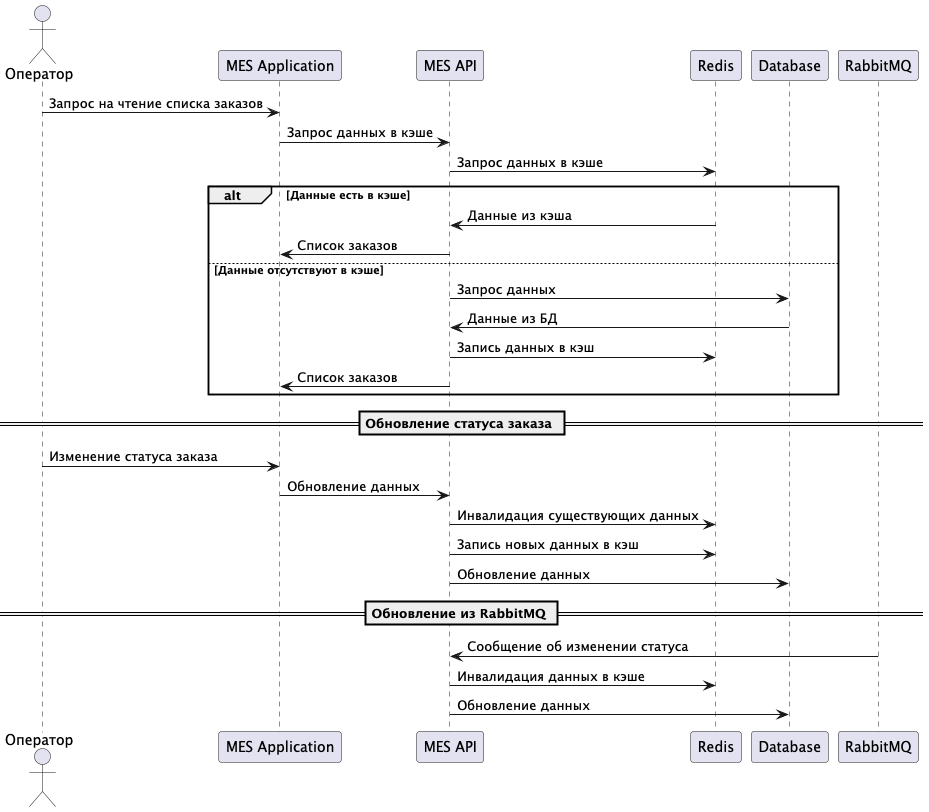

# Архитектурное решение по кешированию

## Анализ диаграммы системы и её описания

В текущей системе проблема заключается в медленной загрузке списка заказов в интерфейсе MES. Операторы часто работают с
заказами в статусе ***MANUFACTURING_APPROVED***, что делает их ключевыми для отображения в системе. Внедрение системы
кэширования позволит ускорить процесс отображения заказов и уменьшить нагрузку на базу данных.

---

## Мотивация

Проблемы, которые решит внедрение кэширования:

1. **Уменьшение времени получения списка заказов операторами MES**: Быстрая загрузка интерфейса повысит
   производительность работы операторов.
2. **Снижение нагрузки на базу данных**: Часто запрашиваемые данные будут извлекаться из кэша, что снизит частоту
   обращения к основной базе.
3. **Улучшение пользовательского опыта**: Операторы смогут быстрее получать информацию, необходимую для работы.

---

## Предлагаемое решение

### Тип кэширования:

Будет использоваться **Серверное кэширование**, так как оно позволяет централизованно хранить и управлять данными,
обеспечивая высокую производительность.

### Выбор технологии:

**Redis** — благодаря высокой скорости работы, поддержке различных структур данных и лёгкости масштабирования, Redis
является оптимальным выбором для нашей системы.

### Паттерн кэширования:

1. **Cache-Aside**:
    - Простота реализации.
    - Подходит для редко изменяемых и часто читаемых данных.
    - Минусы: возможная несогласованность данных в кэше и базе.

2. **Write-Through**:
   - Данные записываются в кэш синхронно при обновлении в базе данных.
   - Преимущества: консистентность данных между базой и кэшем.
   - Минусы: дополнительная задержка при записи данных.

3. **Стратегия инвалидации кэша**:
    - **Инвалидация по ключу**: данные в кэше обновляются только при изменении в базе данных.
    - **TTL (Time-to-Live)**: устанавливается время жизни для кэша, после истечения которого данные обновляются.

### Применение:

1. **Список заказов в MES:**
    - Кэширование заказов в статусе ***MANUFACTURING_APPROVED***.
    - Использование TTL для автоматического обновления данных раз в сутки.
2. **Список товаров в интернет-магазине:**
    - Кэширование популярных товаров.
    - Обновление кэша при изменении ассортимента.

---

## Диаграмма последовательности действий

Для описания процесса работы кэша, используем следующую диаграмму:

### Операция чтения списка заказов:

1. Оператор отправляет запрос на список заказов в MES.
2. MES обращается к Redis:
    - Если данные есть в кэше (Cache Hit), они возвращаются оператору.
    - Если данных нет (Cache Miss), MES запрашивает их из базы, кэширует и возвращает оператору.
3. При изменении статуса заказов:
   - Сообщение об изменении статуса отправляется через RabbitMQ.
   - MES слушает это сообщение и инвалидирует соответствующий ключ в кэше.

---

## Диаграмма

